# VideoEditorSwiftUI

Video editing application with great functionality of tools and the ability to export video in different formats.

## Features

- **Creating a video project and saving its progress**
- **Cropping video**
- **Changing the video duration**
- **Adding filters and effects to videos**
- **Adding text to a video**
- **Recording and editing audio**
- **Adding frames to videos**
- **Saving or share videos in different sizes**

## Includes

- SwiftUI
- iOS 16+
- MVVM
- Combine
- Core Data
- AVFoundation
- AVKit

## Screenshots 📷

### Projects and editor views

  

  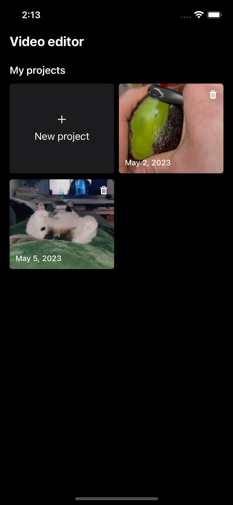
  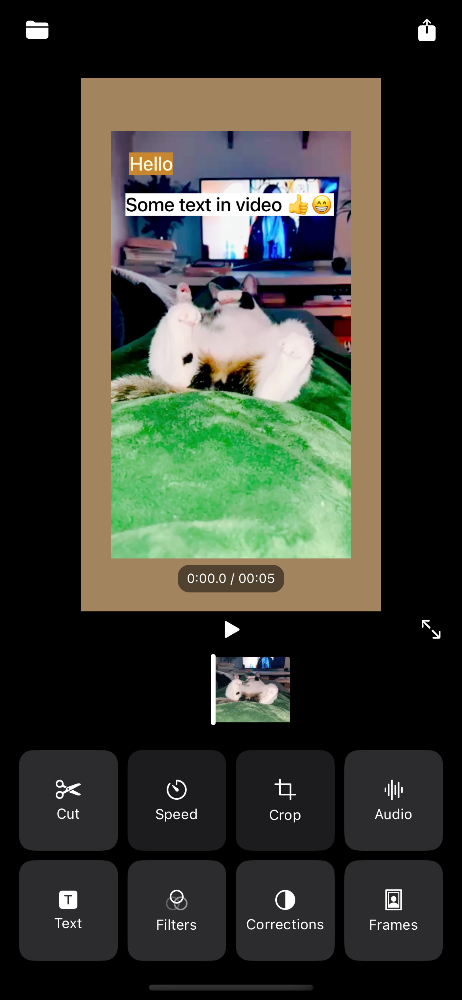
  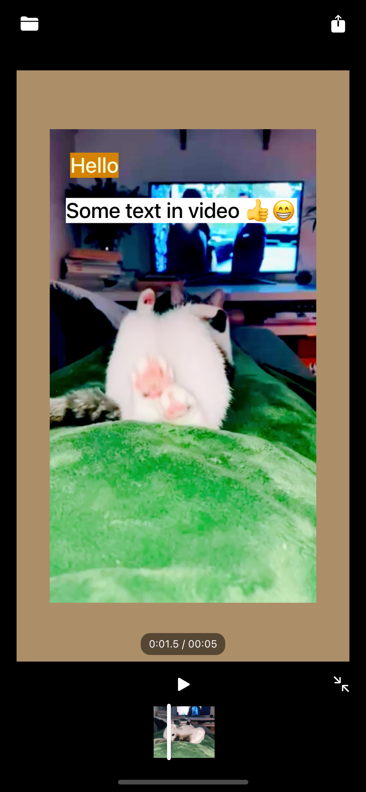
  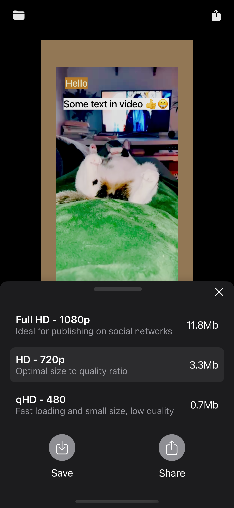
  

  
  
### Editor tools

  

  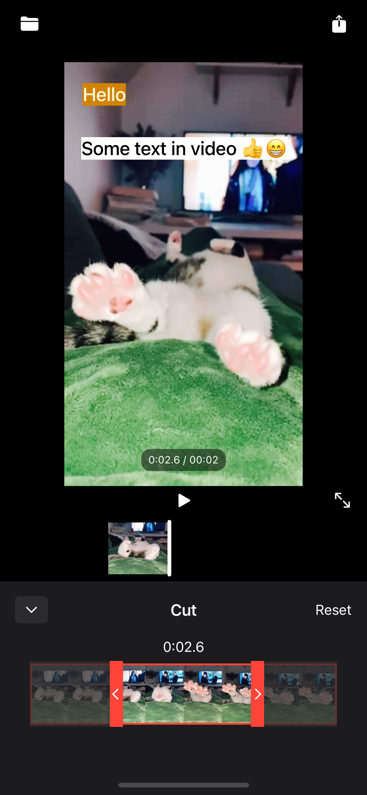
  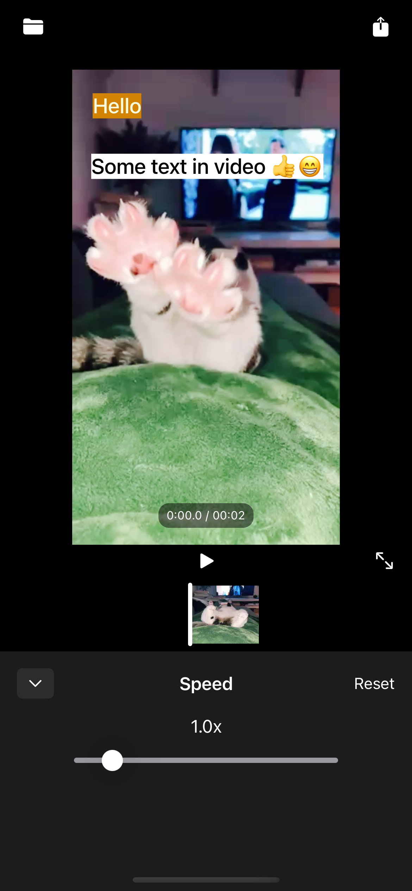
  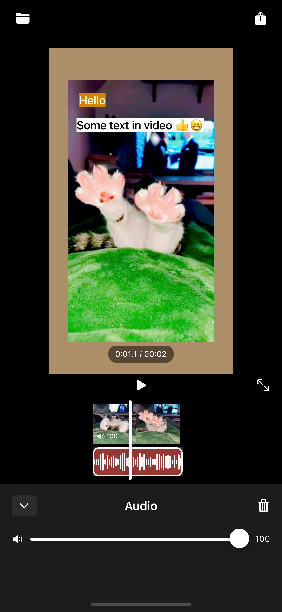
  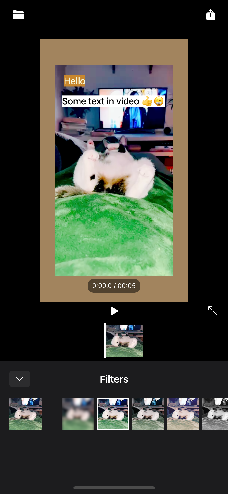
  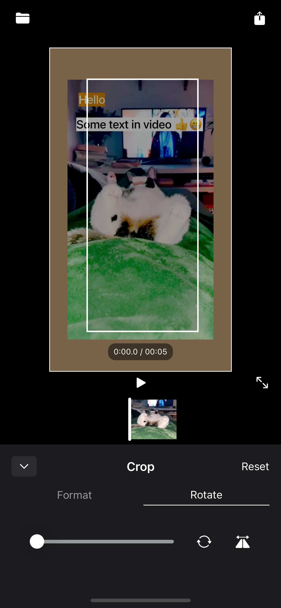
  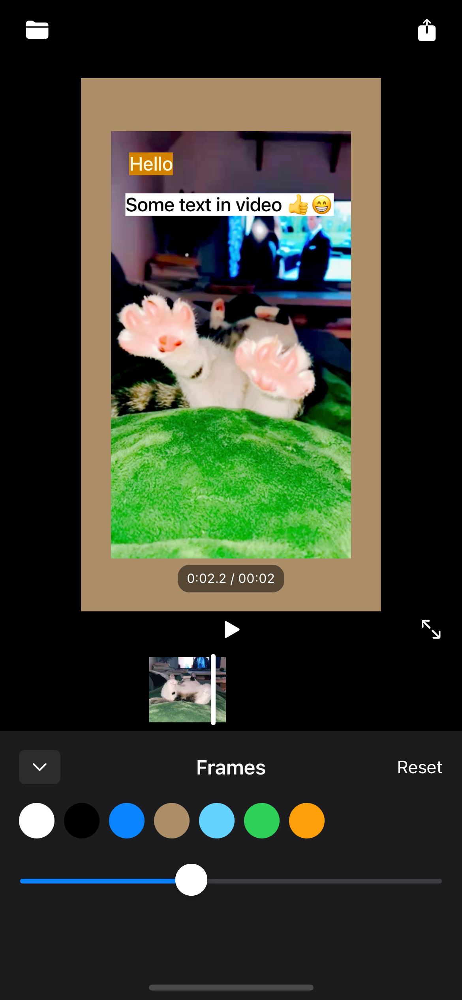
  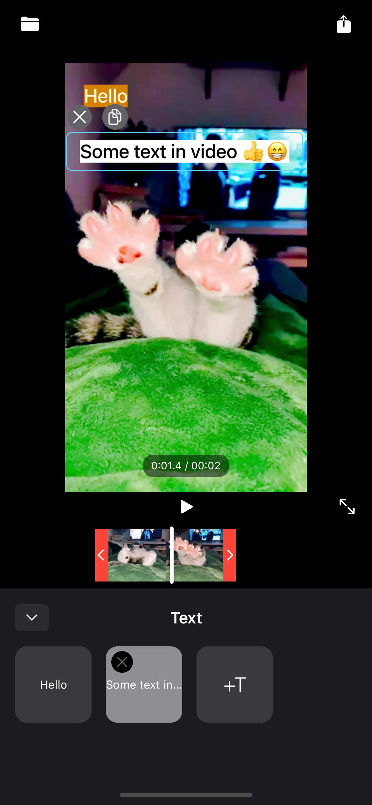
  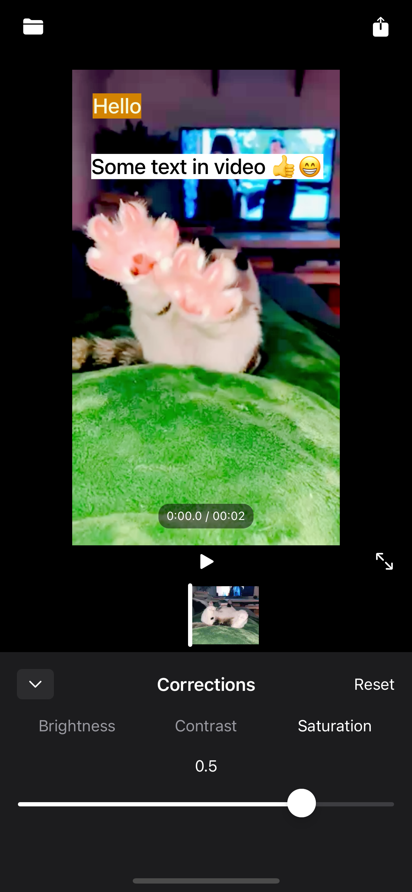
  

  
  

###

  
  
